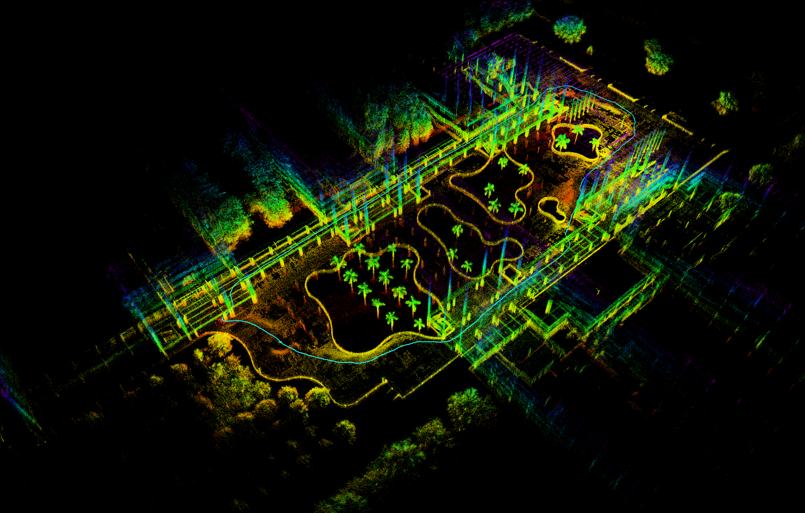
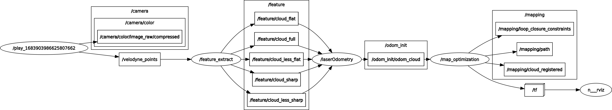

# LO-SAM



LIO-SAM的阉割版本，去掉了IMU预积分部分和GPS因子的纯激光SLAM。结合了LOAM和LIO-SAM的思想，先进行特征提取得到平面特征和边缘特征点云，进行scan-to-scan点云配准得到粗略的激光里程计，再将粗略激光里程计作为初始值进行scan-to-map的配准得到激光里程计，在次步骤中主要采用LIO-SAM的配准方法，保存关键帧，进行ICP回环检测。在效果上，轨迹精度方面肯定不如LIO-SAM（因为IMU预积分紧耦合作用提高了许多），但比A-LOAM好许多，如果大范围建图长期会导致累计误差增加，使得点云地图漂移。节点消息流程图：



详细介绍参见[CSDN](https://blog.csdn.net/weixin_41681988/article/details/130658677?spm=1001.2014.3001.5501)

## 安装依赖

该程序基于LIO-SAM，安装和LIO-SAM一样的依赖即可（需要安装GTSAM库）

```shell
sudo add-apt-repository ppa:borglab/gtsam-release-4.0
sudo apt update
sudo apt install libgtsam-dev libgtsam-unstable-dev
```

## 编译运行

```shell
mkdir -p LO-SAM/src
cd LO-SAM/src
git clone https://github.com/Xujianhong123Allen/LO-SAM.git
catkin build
source devel/setup.bash
# 运行程序，默认传感器为Velodyne VLP16
roslaunch lo_sam lo_sam_vlp16.launch  
```

可以修改`config/VLP16.yaml`的激光雷达配置，另外雷达点云话题中需要包含ring信息，目前只提供了Velodyne和Ouster类型的雷达。如果要保存点云地图，将`savePCD`设置成`true`

在这里提供几个测试数据(百度网盘)

- VLP16测试: https://pan.baidu.com/s/1EuVTli7PGwbJE11a-K6iUQ ，hame
- OS1-32测试： https://pan.baidu.com/s/11AgYW1Az1taRa6neOgv48w ，3yav

[演示视频](https://www.bilibili.com/video/BV1DV4y1r7XB/?spm_id_from=333.999.0.0)

---

## 致谢[LIO-SAM](https://github.com/TixiaoShan/LIO-SAM)、[A-LOAM](https://github.com/HKUST-Aerial-Robotics/A-LOAM)


